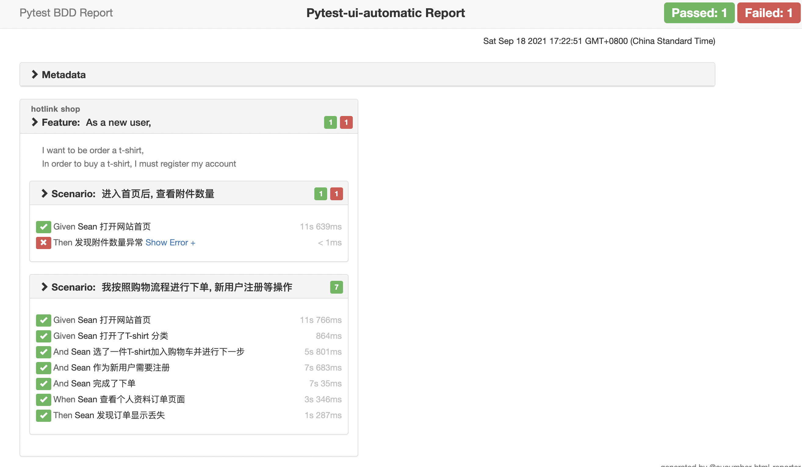
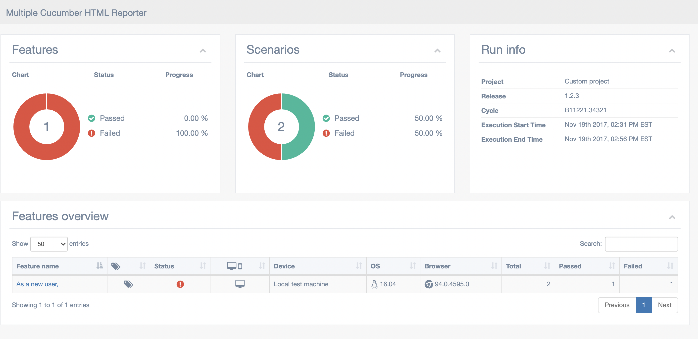

# playwright-pytest-bdd
[Playwright Python](https://github.com/Microsoft/playwright-python) tool practice
pytest pytest-bdd page-object allure cucumber-report

## How to run
1. Run tests `execute_tests_bdd.sh`

## Docker
Execute tests - `docker-compose run tests`

Rebuild container - `docker-compose build --no-cache setup`

## Cucumber Html Report

npm i cucumber-html-reporter
node generate-html-report.js

npm install multiple-cucumber-html-reporter 
node generate-multiple-cucumber-html-report.js 

## Pytest BDD

pytest-bdd generate features/shop/shop_order_t_shirt.feature > step_definition/shop/test_shop.py

Test code generation helpers
For newcomers it's sometimes hard to write all needed test code without being frustrated. To simplify their life, simple code generator was implemented. It allows to create fully functional but of course empty tests and step definitions for given a feature file. It's done as a separate console script provided by pytest-bdd package:

pytest-bdd generate <feature file name> .. <feature file nameN>
It will print the generated code to the standard output so you can easily redirect it to the file:

pytest-bdd generate features/some.feature > tests/functional/test_some.py
Advanced code generation
For more experienced users, there's smart code generation/suggestion feature. It will only generate the test code which is not yet there, checking existing tests and step definitions the same way it's done during the test execution. The code suggestion tool is called via passing additional pytest arguments:

pytest --generate-missing --feature features tests/functional